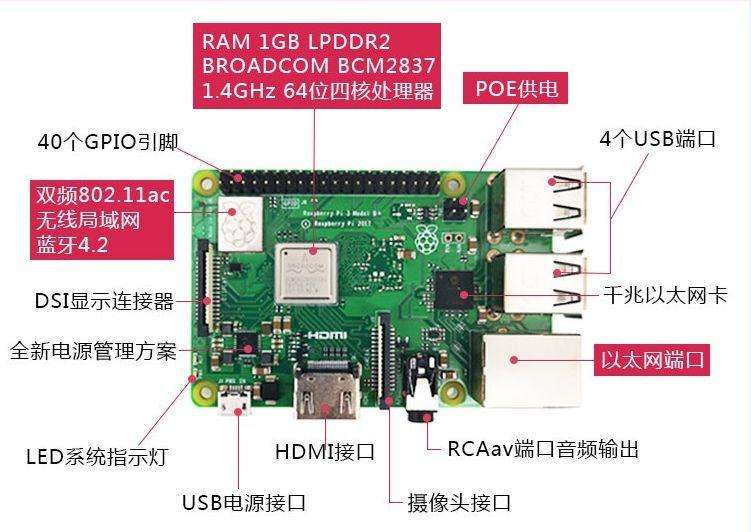
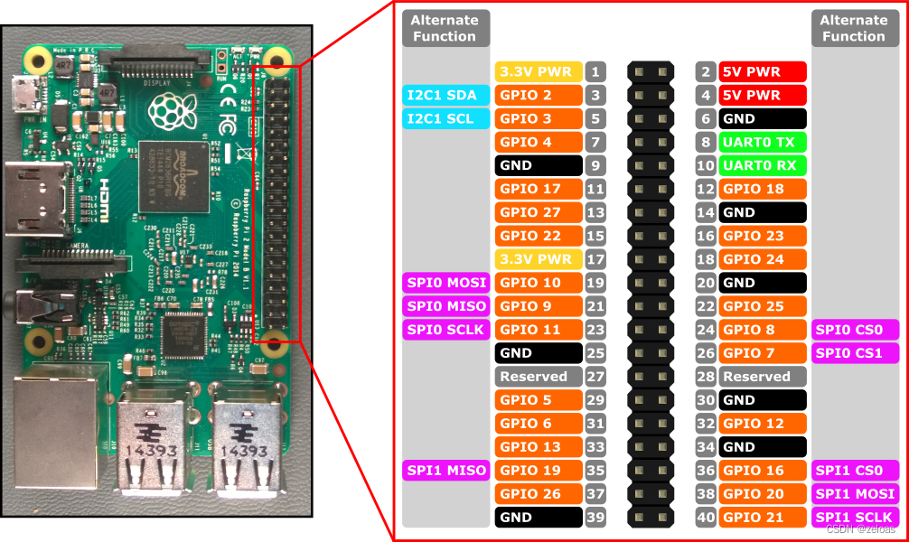

# 【开发板名称】树莓派3b

**简介**
- 四核 1.2GHz 博通 BCM2837 64 位 CPU 处理器
- 1GB 内存
- BCM43438 无线局域网和蓝牙低功耗 （BLE） 板载
- 100 以太网端口
- 40 引脚扩展通用输入端口
- 4个USB2.0端口
- 4极立体声输出和复合视频端口
- 全尺寸HDMI
- CSI相机端口，用于连接树莓派相机
- DSI显示端口，用于连接树莓派触摸屏显示器
- TF端口，用于加载操作系统和存储数据

****

**版本特性**

- 集成了dropbear，用来连接ssh服务

**一、搭建开发环境**

**1、安装依赖工具**

安装命令如下：

```
sudo apt update&&sudo apt install -y openjdk-8-jre gcc-arm-linux-gnueabihf binutils git git-lfs gnupg flex bison gperf build-essential zip curl zlib1g-dev gcc-multilib g++-multilib libc6-dev-i386 lib32ncurses5-dev x11proto-core-dev libx11-dev lib32z-dev ccache libgl1-mesa-dev libxml2-utils xsltproc unzip ruby m4 wget bc python python3 libssl-dev mtools gnutls-bin device-tree-compiler libtinfo5
```

如果使用docker还需要加上以下内容：
```
apt install -y nodejs python3-pip dosfstools
```

**说明：** 
以上安装命令适用于Ubuntu20.04，其他版本请根据安装包名称采用对应的安装命令。

**2、获取标准系统源码**

**前提条件**

1）注册码云gitee账号并配置用户信息
```
git config --global user.name "yourname"

git config --global user.email "your-email-address"
```

2）安装码云repo工具，可以执行如下命令。

```
curl https://gitee.com/oschina/repo/raw/fork_flow/repo-py3 | sudo tee /usr/local/bin/repo >/dev/null &&sudo chmod a+x /usr/local/bin/repo &&sudo ln -sf bash /bin/sh
```

**获取源码操作步骤**

通过repo + https 下载。

```
（这里链接需要替换）
repo init -u https://gitee.com/d1124/manifest.git -b OpenHarmony-3.2-Beta1 -m chipsets/raspberrypi3.xml -g ohos:standard --no-repo-verify --depth=1

repo sync -c

repo forall -c 'git lfs pull'
```

**执行prebuilts**

在源码根目录下执行脚本，安装编译器及二进制工具。

```
./build/prebuilts_download.sh
```

下载的prebuilts二进制默认存放在与OpenHarmony同目录下的OpenHarmony_2.0_canary_prebuilts下。

**二、编译和烧录**

**1、编译**

在Linux环境进行如下操作:

进入源码根目录，执行如下命令进行版本编译。

```
./build.sh --product-name rpi3 --ccache --build-target firmware
```


编译所生成的文件都归档在out/rpi3/目录下，结果镜像输出在
out/rpi3/packages/phone/images/ 目录下。

3） 编译源码完成，请进行镜像烧录。

**2、烧录工具**

烧录需要用到至少16G的TF卡和一个读卡器。

首先使用SDCardFormatter格式化TF卡，之后使用Win32DiskImager烧写out/rpi3/packages/phone/images/路径下的firmware.img文件。

[SDCardFormatter](https://www.sdcardformatter.com/download/)

[Win32DiskImager](https://win32diskimager.org/#download)

**三、调试**

**1、连接串口**

串口引脚图如下：
****
1、连接图中6、8、10三个引脚。
2、打开Xshell，新建会话，在连接的协议中选择SERIAL。
3、转到串口标签，选择正确的端口号，波特率115200，完成后即可连接。

**2、连接ssh服务**

1、查询本机ip地址：在Windows命令行输入ipconfig或在Linux命令行输入ifconfig查询。
2、配置树莓派ip地址：在SDK中找到的third_party/dropbear/openharmony-develtools路径下的dropbear.cfg文件,修改配置ip的指令，改为"exec /system/bin/ifconfig eth0 {与本机ip地址相近的ip地址}"。或者通过串口直接输入ifconfig eth0 {与本机ip地址相近的ip地址}配置。
3、查询连接状态：烧录后将树莓派接到路由器上启动，可通过串口或在主机输入ping指令查询ip是否配置成功。
4、通过ssh连接：Ping成功后，可通过Xshell或Xftp连接ssh服务，输入配置的树莓派ip地址，账号root，密码openharmony。可以通过Xshell进入命令行，用Xftp传输文件。

**3、使用HDC工具**

1、首先要将developtools/hdc/src/daemon/main.cpp中22行左右的g_enableTcp值改为true。
2、重新编译烧录后，通过串口或ssh连接到命令行，输入netstat -tulnp,找到hdcd服务对应的tcp端口号。
3、得到HDC工具后，在主机命令行输入hdc_std tconn {树莓派ip地址}:{hdcd端口号}，输出Connect OK即连接成功。
4、使用HDC工具(命令)：
```
(1)hdc_std shell:进入命令行
(2)hdc_std file send {本地系统文件路径} {oh系统文件路径}:发送文件
(3)hdc_std file recv {oh系统文件路径} {本地系统文件路径}:接收文件
(4)hdc_std install XXX.hap:安装hap包
```
**功能缺失**

- 目前系统不支持HDMI接口，仅支持mipi接口。
- 暂未支持GPU。
- 使用CPU渲染，红色和蓝色颜色反转。

**四、联系**

senwen@iscas.ac.cn

技术问题联系：daiyan@iscas.ac.cn


